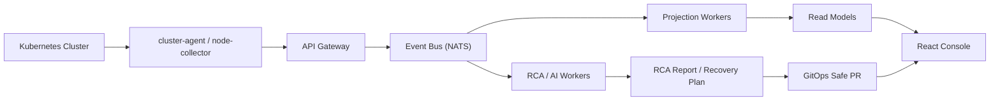

# Kyro

> Kubernetes 운영 정보를 수집하고, 장애 분석(RCA)부터 복구 제안과 Safe PR 흐름까지 연결하는 웹 기반 운영 콘솔입니다.

Kyro는 여러 Kubernetes 클러스터의 리소스, 이벤트, 로그, 메트릭, GitOps 변경 이력을 한 화면에서 확인하고, 장애 발생 시 근거 기반으로 원인 후보와 복구 방향을 제안하는 팀 프로젝트입니다.

이 저장소는 팀 프로젝트 [Jungle-303-04/final](https://github.com/Jungle-303-04/final)을 개인 포트폴리오 제출용으로 fork하여 정리한 저장소입니다.

## 주요 기능

- **멀티 클러스터 운영 현황 확인**
  - 클러스터 연결 상태, 리소스 목록, 토폴로지, 트래픽, 비용 정보를 콘솔에서 조회
- **장애 탐지 및 RCA**
  - Kubernetes 이벤트, 로그, 메트릭, GitOps 변경 이력을 장애 분석 근거로 수집
  - CrashLoopBackOff, 이미지 문제, 네트워크, 스케줄링, 리소스 압박 등 원인 후보를 rule 기반으로 평가
- **복구 제안 및 검토 흐름**
  - RCA 결과를 바탕으로 복구 액션 후보를 생성
  - 자동 실행이 위험한 작업은 승인/검토 단계를 거치도록 분리
- **GitOps / Safe PR 연동**
  - 복구가 필요한 변경을 직접 적용하지 않고 PR 기반으로 검토할 수 있도록 연결
  - 변경 이력과 장애 시점을 RCA 근거로 함께 사용
- **웹 콘솔 UI**
  - Incidents, Resources, Topology, GitOps, Applications, Timeline, Alerts 등 운영 화면 제공

## 기술 스택

| 영역 | 기술 |
| --- | --- |
| Frontend | React, TypeScript, Vite, TanStack Table, Recharts, xterm.js |
| Backend | Python, FastAPI, SQLAlchemy |
| Event / Worker | NATS, event-driven worker architecture |
| Storage | PostgreSQL, Redis |
| DevOps | Docker, Kubernetes, Helm, Kustomize |
| Observability | Prometheus, Loki, OpenTelemetry |
| Test / Quality | Pytest, Ruff, Vitest, ESLint |

## 아키텍처 개요



## 담당 영역

> 기여자: `ummfieg`

팀 프로젝트 중 제가 주로 다룬 영역은 **RCA rule 흐름과 복구 검토 흐름 보강**입니다.

- **RCA rule catalog 보강**
  - CrashLoop, rollout dependency, scheduling, network, resource pressure 등 장애 후보 rule 확장
  - rule별 판단 근거와 누락 근거를 구분해 RCA 결과가 더 설명 가능하도록 정리
  - 관련 파일: `src/services/ai/agent/causes/catalog/*`, `tests/test_rca_rule_catalog.py`

- **RCA evidence 흐름 정리**
  - provider evidence 응답 스키마와 evidence key를 정리
  - GitOps 변경 이력과 장애 분석 근거를 연결하는 흐름 보강
  - 관련 파일: `tests/test_rca_evidence.py`, `src/domains/rca/events.py`, `src/domains/rca/report_projection.py`

- **복구 제안 / 승인 흐름 보강**
  - 복구 액션의 실행 채널, 승인 필요 사유, Safe PR 유형을 구분
  - 자동 복구와 검토 필요 복구를 분리해 위험 작업이 바로 실행되지 않도록 흐름 정리
  - 관련 파일: `src/services/ai/agent/recovery/*`, `tests/test_recovery_authority_patches.py`

- **RCA / 복구 UI 일부 개선**
  - incident RCA 상세, 복구 진행 상태, Safe PR 연결 상태가 화면에서 더 명확히 보이도록 일부 UI 흐름 보강
  - 관련 파일: `frontend/src/devpreview/rcaDetailFeed.ts`, `frontend/src/devpreview/recoveryProgress.ts`

- **문서화**
  - RCA evidence schema, rule catalog, provider evidence, recovery action compatibility 관련 문서 정리
  - 관련 파일: `docs/rca-production-onboarding/*`

## 주요 디렉터리

```text
frontend/                  React 기반 운영 콘솔
src/domains/               FastAPI 도메인 라우터와 비즈니스 로직
src/services/              이벤트 기반 worker, gateway, cluster-agent
src/services/ai/agent/     RCA 원인 후보, 복구 액션, AI agent 로직
charts/opsia/              Helm chart
deploy/                    Kubernetes 배포 매니페스트
tests/                     백엔드/RCA/복구 흐름 테스트
```

## 로컬 확인

전체 시스템은 Kubernetes 클러스터, 환경변수, 외부 연동 설정이 필요합니다. 코드 확인과 정적 검사는 아래 명령을 기준으로 진행합니다.

```bash
# Python 의존성 동기화
uv sync

# 백엔드 린트
make lint

# 백엔드 테스트
make test

# 프론트엔드 실행
cd frontend
npm install
npm run dev
```

라이브 백엔드에 프론트엔드를 연결해 확인할 때는 루트에서 아래 명령을 사용할 수 있습니다.

```bash
make frontend-live
```

## 프로젝트를 통해 학습한 점

- Kubernetes 운영 데이터가 로그/메트릭/이벤트/GitOps 변경 이력으로 분산되어 있어, RCA 결과를 신뢰 가능하게 만들려면 근거 수집과 누락 근거 표현이 중요하다는 점
- 복구 자동화는 실행 자체보다 안전장치가 중요하며, 승인/검토/Safe PR 같은 단계가 필요한 이유
- 대규모 팀 프로젝트에서는 기능 구현만큼 API 계약, 테스트, 문서화가 중요하다는 점
